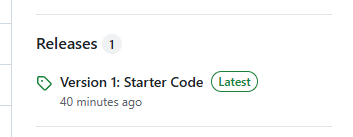
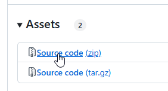

<!-- Improved compatibility of back to top link: See: https://github.com/othneildrew/Best-README-Template/pull/73 -->
<a name="readme-top"></a>

<!--
*** Thanks for checking out the Best-README-Template. If you have a suggestion
*** that would make this better, please fork the repo and create a pull request
*** or simply open an issue with the tag "enhancement".
*** Don't forget to give the project a star!
*** Thanks again! Now go create something AMAZING! :D
-->


<div align="center">

<h3 align="center">
    project title 
</h3>

<p align="center">
    A 1 line project description
</p>
</div>


<!-- ABOUT THE PROJECT -->

## About The Project

Here's a blank template to get started: To avoid retyping too much info. Do a search and replace with your text editor
for the following: `github_username`, `repo_name`, `twitter_handle`, `linkedin_username`, `email_client`, `email`,
`project_title`, `project_description`

<p align="right">(<a href="#readme-top">back to top</a>)</p>


<!-- GETTING STARTED -->

## Getting Started

This is an example of how you may give instructions on setting up your project locally.
To get a local copy up and running follow these simple example steps.

### Prerequisites

This is an example of how to list things you need to use the software and how to install them.

* npm
  ```sh
  npm install npm@latest -g
  ```

### Installation

1. Go to the following repository: https://github.com/AdyGCode/xxx-fastapi-base-code
2. Find the Releases entry on the right side of the page:



3. Click on the title of the latest release (eg. Version 1: Starter Code)
4. In the Assets area, locate the Source Code Zip file. Click to Download Source Code (zip)



5. Once Downloaded, open the Windows File Explorer (WIN+E)
6. With File Explorer open, navigate to your downloads folder
7. Locate the downloaded file, and Right Mouse on it
8. Select the "Other Options" item at the bottom of the pop-up dialog box
9. Hover over the '7-Zip' option and then click on "Extract to ...", where the ... is the name of the compressed file.

> If you do not have 7-Zip installed we highly recommend you do so.

10. Then open the Windows Terminal application, with the Git Bash CLI.
11. Use the following commands to copy the new folder to your Source/Repos folder:
```shell
cd /c/Users/USERNAME/Downloads
mv xxx-fastapi-site-base-1 ../Source/Repos/INITIALS-fastapi-site-1
```

12. Change into the new folder and initialise version control:
```shell
cd ../Source/Repos/INITIALS-fastapi-site-1
git init .
git add .
git commit -m "Base Site: Files by Adrian Gould"
```
13. We now need to create/recreate the python virtual environment:
```shell
python -m venv .venv
source .venv/Scripts/activate
```
14. Install the requirements for this FastAPI project:
```shell
pip install -r requirements.txt
```

You may update the requirements using the command:

```shell
pip install --upgrade PACKAGE_NAME PACKAGE_NAME_2 ...
```

Replacing the PACKAGE_NAME with the name of the packages that have been installed.


<p align="right">(<a href="#readme-top">back to top</a>)</p>


<!-- USAGE EXAMPLES -->

## Usage

Use this space to show useful examples of how a project can be used. Additional screenshots, code examples and demos
work well in this space. You may also link to more resources.

_For more examples, please refer to the [Documentation](https://example.com)_

<p align="right">(<a href="#readme-top">back to top</a>)</p>


<!-- CONTACT -->

## Contact

Your Name - [@twitter_handle](https://twitter.com/twitter_handle) - email@email_client.com

Project Link: [https://github.com/github_username/repo_name](https://github.com/github_username/repo_name)

<p align="right">(<a href="#readme-top">back to top</a>)</p>


<!-- ACKNOWLEDGMENTS -->

## Acknowledgments

* [Name](URI)
* [Name](URI)
* [Name](URI)

<p align="right">(<a href="#readme-top">back to top</a>)</p>


